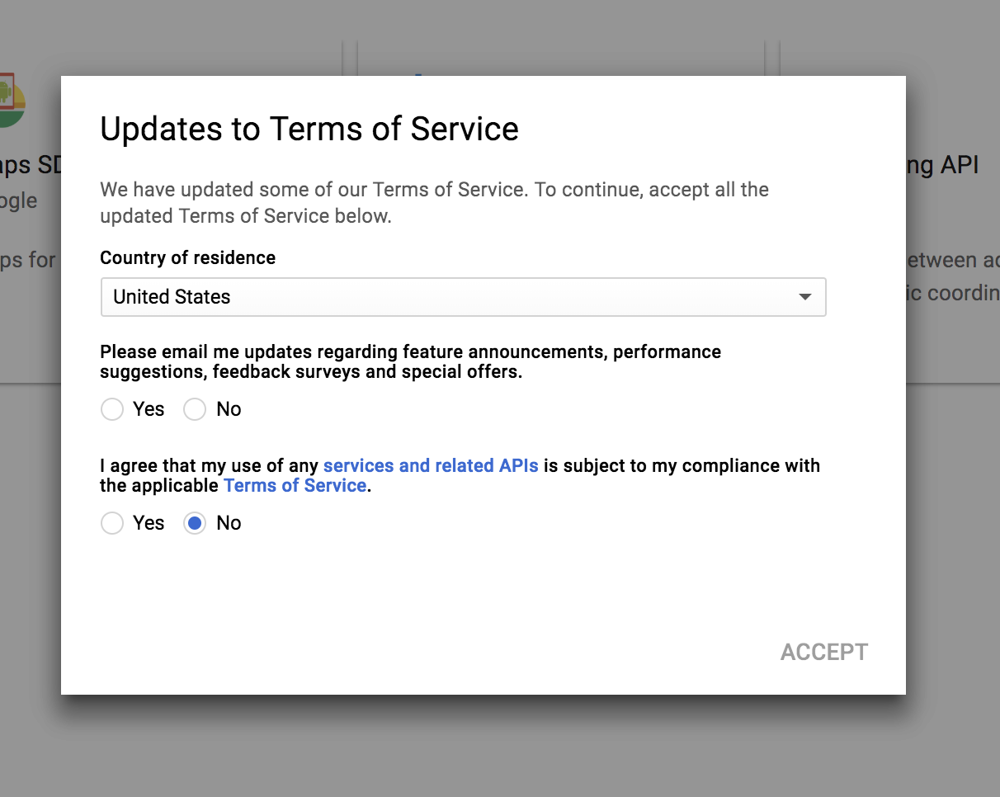
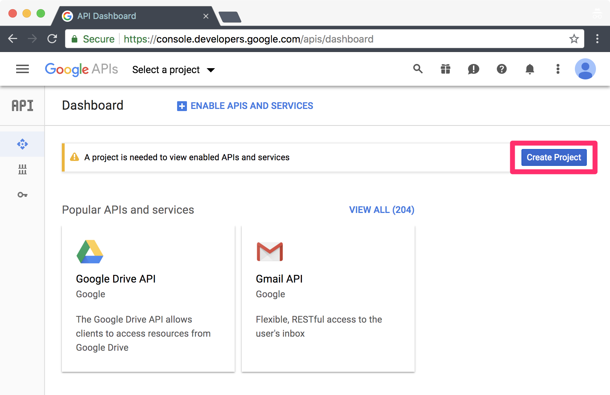
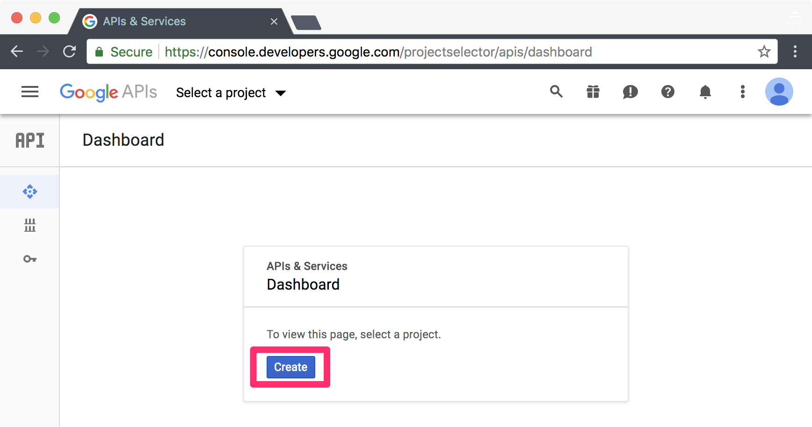
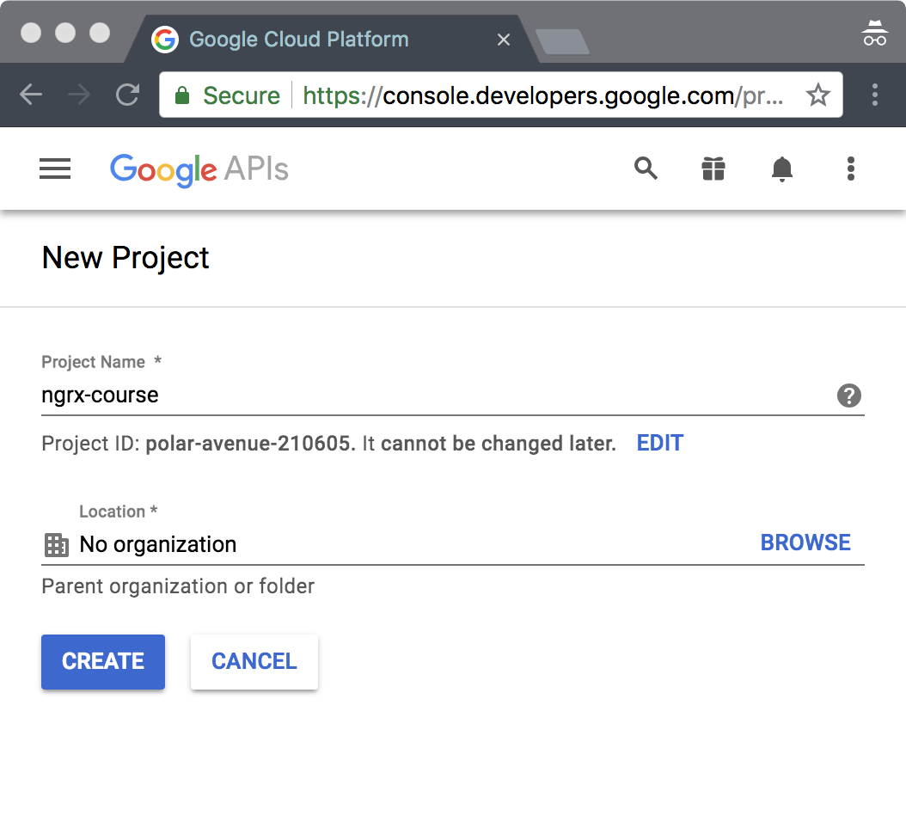
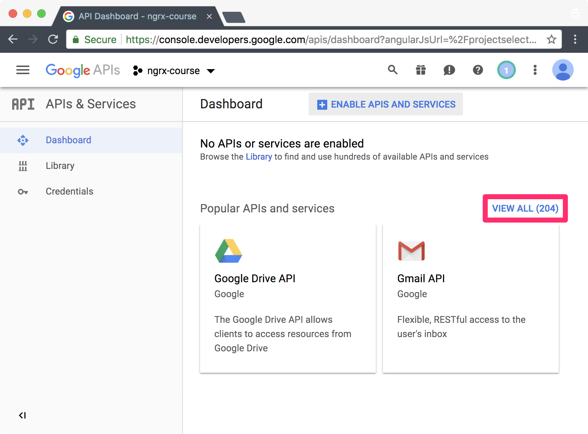
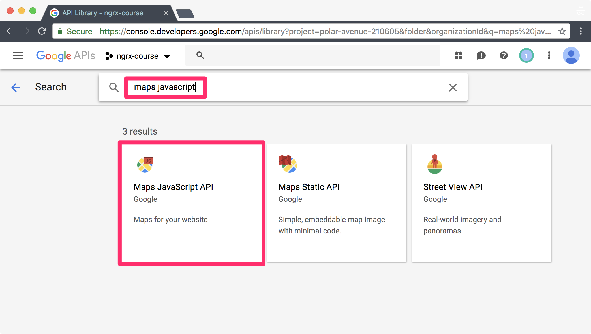
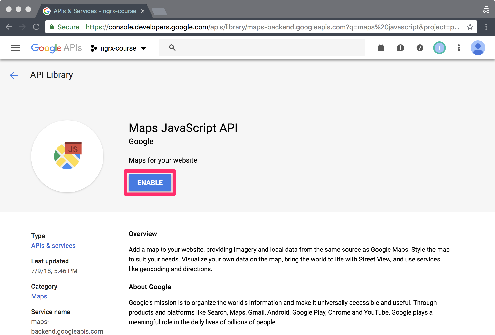
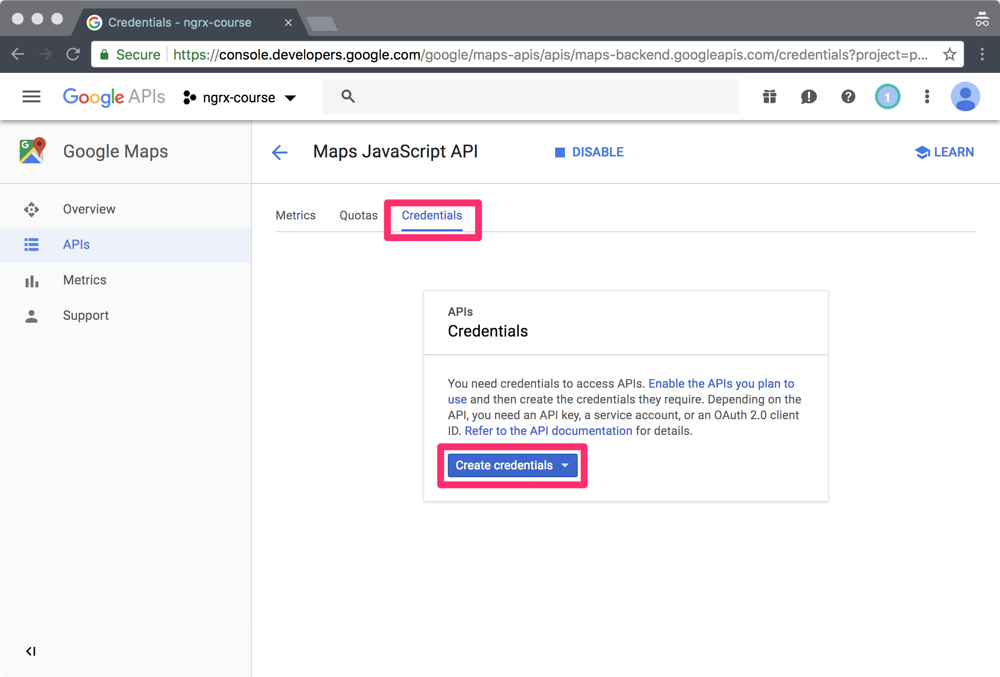
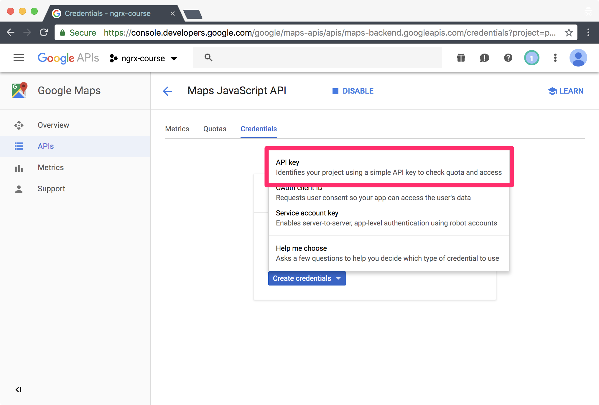
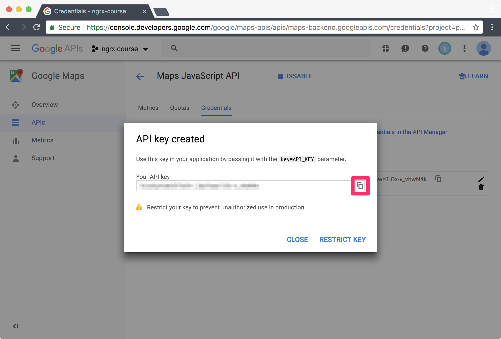

# Getting Started

Let's go ahead and install all of the NgRx libraries:

```bash
npm install @ngrx/{effects,entity,router-store,schematics,store,store-devtools}
yarn add @ngrx/{effects,entity,router-store,schematics,store,store-devtools}
```

## Configure Schematics

Update the Angular CLI project to set the NgRx schematics as the default:

```bash
ng config cli.defaultCollection @ngrx/schematics
```

## Redux Devtools

Using the NgRx *store-devtools* library we can use the Redux Devtools to:

* view the actions being dispatched,
* have insight into the state tree for each given action,
* scrub through the timeline of actions that have been dispatched, and
* dispatch an action we are debugging.

Install the Redux Devtools:

* [Chrome extension](https://chrome.google.com/webstore/detail/redux-devtools/lmhkpmbekcpmknklioeibfkpmmfibljd)
* [Firefox Add-on](https://addons.mozilla.org/en-US/firefox/addon/remotedev/)

## Google Maps API Key

In order to display an embedded Google Map using the JavaScript library you must [get an API key](https://developers.google.com/maps/documentation/javascript/get-api-key):

1. Log into the [Google Cloud Console](https://console.developers.google.com/apis)
2. You may need to accept the Terms of Service if this is your first time using the Google Cloud Platform.
3. Create a new project named 'ngrx-course'
4. View all of the APIs
5. Search for the 'maps javascript' API
6. Choose the Maps JavaScript API
7. Enable the Maps JavaScript API
8. Go to the *Credentials* tab and choose *Create credentials* > *API key*.
9. Copy the API key.

### Step-by-step screen shots:

**Terms of Service**



**Create project**



**Create API project**



**New project**



**View all APIs**



**Search for Maps JavaScript API**



**Enable Maps JavaScript API**



**Choose Credentials and Create credentials**



**Create an API key**



**Copy API key**



## Angular Google Maps

We'll be using the [Angular Google Maps](https://angular-maps.com/) library to easily display a Google Map:

```bash
npm install @agm/core
yarn add @agm/core
```

Update both the **src/environments/environment.ts** and **src/environments/environments.prod.ts** files with your API key:

```javascript
export const environment = {
  google: {
    maps: {
      apiKey: 'API_KEY'
    }
  }
}
```

### Update `AppModule`

Import the `AgmCoreModule` in the `AppModule`:

```javascript
@NgModule({
  imports: [
    AgmCoreModule.forRoot({
      apiKey: environment.google.maps.apiKey
    })
  ]
})
export class AppModule {}

```