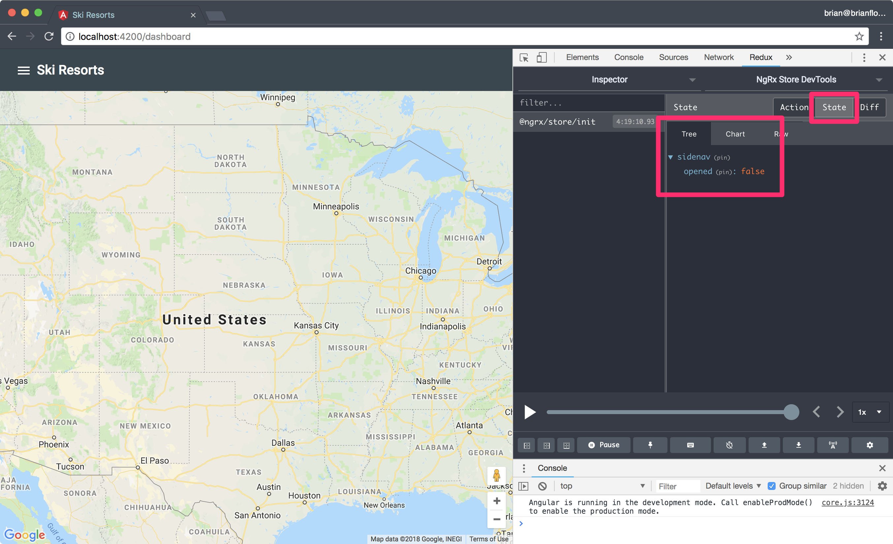

# Sidenav Reducer

With the actions declared for our sidenav, our next step is to create the reducer.
If you recall, the reducer:

* Is a pure function.
* Accepts the current state and an action that describes the state change.
* Returns a new state object (never mutates the existing state object).

Create a new file **src/app/state/sidenav/sidenav.reducer.ts**.

## `State` Interface

The `State` interface defines the properties for the `sidenav` slice of state:

```javascript
export interface State {
  opened: boolean;
}
```

We have defined a single `opened` property, which is a `boolean` value indicating if the sidenav is open or not.

## Initial State

With the `State` interface defined, our next step is to declare the initial state.
The initial state will be the default value for the state of the sidenav.
Initially, we want the sidenav to be hidden, or not open.

```javascript
export const initialState: State = {
  opened: false
};
```

* Declare the `initialState` constant.
* The object is declared with the `State` type to ensure that the `initialState` meets the contract for our state object.
* We set the `opened` initial value to `false`.

## Reducer Function

Finally, create a new `reducer()` function that accepts the current `state` and an `action` that is dispatched:

```javascript
import { SidenavAction, SidenavActionTypes } from './sidenav.actions';

export function reducer(state = initialState, action: SidenavAction): State {
  switch (action.type) {
    case SidenavActionTypes.HideSidenav:
      return {
        ...state,
        opened: false
      };
    case SidenavActionTypes.ShowSidenav:
      return {
        ...state,
        opened: true
      };
    default:
      return state;
  }
}
```

* The `reducer()` function accepts the current `state`, which defaults to the `initialState` we previously declared.
* The `reducer()` function accepts an `action`, which is a `SidenavAction`. By using the type union we can take advantage of the TypeScript compiler to ensure that we reference the appropriate properties declared within each `Action` class.
* We switch on the `type` string value for the `action` that is dispatched.
* When the `SidenavActionTypes.HideSidenav` action is dispatched we return the new state of the application. Using the spread operator we can create a shallow clone of the current `state` and modify the `opened` property to be `false`.
* When the `SidenavActionTypes.ShowSidenav` action is dispatched we return the new state with the `opened` property set to `true`.
* When the `action` doesn't meet any of the switch cases, we return the current `state`.

**Pro Tip**: Don't forget to include the `default` where we return the current `state`. Omitting this will cause the state object to be `undefined`.

What about tests?

Let's focus on learning the NgRx store library implementation then we'll learn how to write unit tests for our reducers and effects.

## Declare Top-Level State Property

Open the **src/app/state/index.ts** file and add a new `sidenav` property to the `State` interface:

```javascript
import { State as SidenavState } from "./sidenav/sidenav.reducer";

export interface State {
  sidenav: SidenavState
}
```

**Pro Tip**: Note that I used an alias for the imported `State` interface from the **sidenav.reducer** module to avoid naming conflicts.
Another option is to import all exported members using the wildcard ( * ) syntax.
I prefer to simply use an aliased import so as not to import all exported members from the module.

## Declare Reducer

You may notice that your editor indicates that there is now an error with the `reducers` object, which is defined as an `ActionReducerMap` of the `State` interface.
This is because the `ActionReducerMap` interface requires that the `reducers`object have keys that match the `State` interface.
Since we just added a new `sidenav` property to `State` we also need to create a `sidenav` property whose value is the `reducer()` function we declared.

Open **src/app/state/index.ts** and add a new `sidenav` property to the `reducers` map:

```javascript
import { ActionReducerMap, MetaReducer } from '@ngrx/store';
import {
  reducer as sidenavReducer,
  State as SidenavState
} from './sidenav/sidenav.reducer';

export const reducers: ActionReducerMap<State> = {
  sidenav: sidenavReducer
};
```

* We have now declare a new top-level property within the state object, often referred to as "feature" state.
* We have also wired up the `reducer()` function to mutate the feature state by returning a new state object when an action is dispatched.

## Using Features Enum

TypeScript version 2.4.0 introduced string enums.
If you are using Angular 5 or greater then we can define the `sidenav` property using an enum.

Open **src/app/state/index.ts** and declare a `Features` enum:

```javascript
export enum Features {
  sidenav = 'sidenav'
}
```

Then, update the `State` interface and `reducers` map to use the enum value:

```javascript
export interface State {
  [Features.sidenav]: SidenavState;
}

export const reducers: ActionReducerMap<State> = {
  [Features.sidenav]: sidenavReducer
};
```

**Pro Tip**: This provides little to no value now as the `ActionReducerMap` interface ensures the map contains the same keys as the `State` interface.
However, we'll see the advantage to use the enum when we declare the top-level state property using `createFeatureSelector()`.

## Serve the Application

Execute either command to serve the application on [http://localhost:4200](http://localhost:4200)

```bash
npm start
yarn start
```

Open the Chrome or Firefox developer tools and select the *Redux* tab.
You should now see the initial state of the application:



* Note that I selected the "State" tab to show the full state object.
* The `sidenav` top-level state property contains the `opened` boolean value, which defaults to `false`.